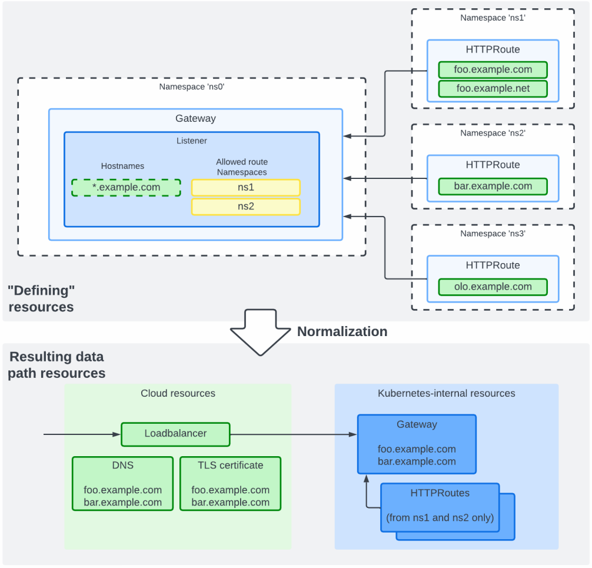

# Normalization of Gateway Resources

This document describes how Gateway API resource specifications are
normalized before any resources are created.

## Motivation

The *cloud-gateway-controller* cannot simply create resources as plain
copies of the gateway API resources defining a data path because there
is not necessary a 1:1 correspondence between these 'specifying'
resources and the resources that are needed to define the data path
such as TLS certificates.

In the figure below, an example is shown, where the `Gateway` resource
does not specify hostnames, but the three `HTTPRoute`s that reference
the `Gateway` do. The `Gateway` does not allow `HTTPRoute`s from
namespace `ns3` hence this `HTTPRoute` must be ignored. The
`HTTPRoute`s from `ns1` and `ns2` are allowed by the `Gateway` so
collectively the data path will allow only the two domains associated
with those routes and only where the host name on the `Gateway`
listeners [intersect (see gateway API
spec)](https://gateway-api.sigs.k8s.io/references/spec/#gateway.networking.k8s.io%2fv1beta1.Listener)
with the `HTTPRoute` hostname(s).

The *cloud-gateway-controller* will normalize the 'defining resources'
such that it can (depending on the actual data path definition
specified in the applied `GatewayClass`) create Cloud resources like
TLS certificate and DNS entry as well as a Kubernetes-internal
`Gateway` using the two allowed domains. This is illustrated below.

